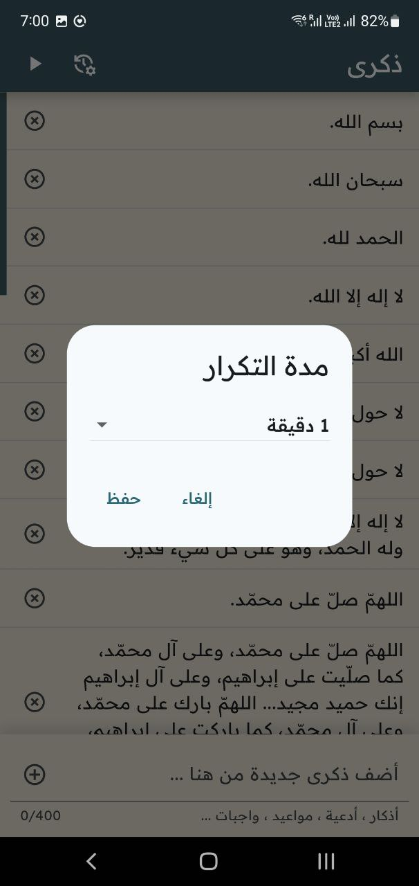
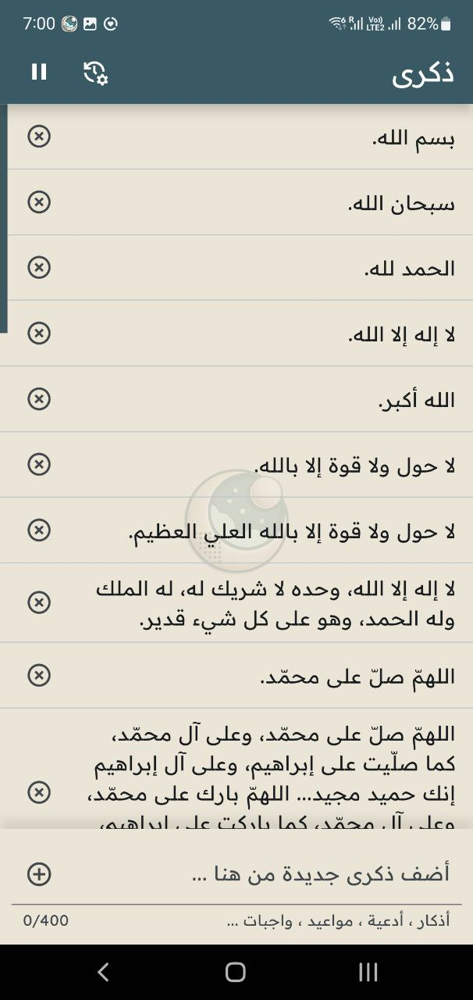
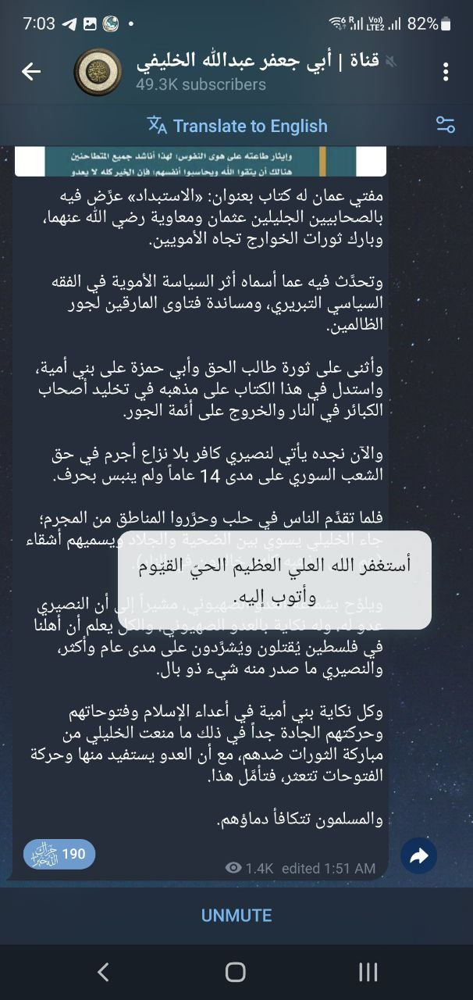

<div align="center">
    بسم الله الرحمن الرحيم
</div>

<div align="right">

# تطبيق ذكرى

تطبيق [Flutter](https://flutter.dev) للتذكير بالأذكار والأدعية والآيات أو المواعيد والمهمات على هيئة منبثقات فوق التطبيقات الأخرى يمكن تحريكها وإخفاؤها.





### الخصائص

- إمكانية إضافة تذكيرات مهما كان نوعها كنصوص، وبحد 400 حرف للذكرى
- قابلية حذف المضاف كذلك
- القدرة على تعيين فترة التكرار بالاختيار من القياسية منها بالثواني أو الدقائق أو الساعات
- إمكانية إيقاف وتشغيل خدمة التطبيق الأساسية عند الحاجة


## الاستخدام

الترميز بالكامل [مفتوح المصدر](#الترخيص) ومتاح للجميع للاستفادة وبناء التطبيق بأنفسهم. ولكننا أيضا نقوم ببناء نسخة جاهزة للتنصيب والاستعمال مع كل تحديث جديد، لتسهيل الأمر على العامة.

والتعليمات هي كما يلي:

### نظام أندرويد (الهاتف)

- قم بتحميل آخر إصدار (رقم) من قسم "[الإصدارات](https://github.com/VPremiss/thikra_app/releases)" من صفحتنا هذه، ومن نوع APK كملف.
- قم بالضغط على الملف نفسه في هاتفك لبدء تنصيبه.
- قم بالسماح للمصادر الغير معروفة بتنزيله، وبتجاوز فحص الحماية الخاص بـ Google إن طلب ذلك.
- قم بتشغيل التطبيق من نفس قائمة التطبيقات الأخرى.


## التطوير

يمكن تحسين الأداء من خلال ([state management](https://riverpod.dev/)).

أي مساعدة في التطوير أو التصميم أو الترويج نقدرها لكم، والله يحب المحسنين؛ وجزاكم الله خيرا.

### الأوامر

- إن قمتم بتعديل أو إضافة object-box جديد، فيجب تشغيل أمر بناء مكوناته في كل مرة:

  ```bash
  flutter pub run build_runner build
  ```

- إن قمت بتعديل الأيقونة أو لون الخلفية الرئيسة، قم بإعادة صناعة الأيقونات وخلفياتها باستخدام:

  ```
  dart run icons_launcher:create
  dart run flutter_native_splash:create
  ```

  > [!IMPORTANT]
  > الترتيب مهم، وليس اعتباطيًّا!

### الحزم المستخدمة

</div>

<div align="left">

- [flutter_foreground_task](https://pub.dev/packages/flutter_foreground_task)
- [overlay_pop_up](https://pub.dev/packages/overlay_pop_up)
- [is_lock_screen](https://github.com/GoodM4ven/flutter_is_lock_screen) (Fork)
- [shared_preferences](https://pub.dev/packages/shared_preferences)
- [objectbox](https://pub.dev/packages/objectbox)
- [path_provider](https://pub.dev/packages/path_provider)
- [path](https://pub.dev/packages/path)
- [flutter_native_splash](https://pub.dev/packages/flutter_native_splash)

- [package_rename](https://pub.dev/packages/package_rename)
- [icons_launcher](https://pub.dev/packages/icons_launcher)
- [build_runner](https://pub.dev/packages/build_runner)

</div>

<div align="right">

### المهمات

- // TODO نشر التطبيق في [F-Droid](https://f-droid.org) مفتوح المصدر، وكذلك في السوق العادي للأندرود.
- // TODO العمل على تنظيم برمجة التطبيق باستخدام [Riverpod](https://riverpod.dev) لإدارة الـ state، والذي إن شاء الله سيقوم بدوره في دعم سرعة أداء التطبيق بشكل عام.
- // TODO إعادة تمصميم من قبل محترف للألوان والانتقالات وكذا الشعار والخلفية.
- // TODO الترويج للتطبيق ونشره، ودعم منصات نشره بالكلمات المفتاحية السليمة والمساعدة.

- // TODO إضافة خيار للتحكم بمدة اختفاء المنبثق تلقائيًّا، في حال عدم التفاعل معه.
- // TODO نقل الإعدادات إلى صفحة كاملة خاصة مع منسدلة من اليمين.
- // TODO إضافة خيار لعدم السماح بالتكرار لمحتوى التذكيرات.
- // TODO خيارات الانبثاق من الجوانب للتذكيرات.
- // TODO إضافة صفحة لقسم حولنا يشرح الفكرة ورابط الترميز، وتظهر في المنسدلة اليمنى أيضا.
- // TODO خاصية مع خيار التلفظ بالتذكير لاختفائه حصرًا!
- // TODO خوارزمية أفضل لحساب حجم المنبثق بدل التقدير اليدوي حسب الأسطر المقدّرة أيضًا!
- // TODO إضافة خيارات خطوط متعددة.
- // TODO خيارات التعديل على نمط المنبثقات.

### الإنجاز

يمكنك أيضًا تفقّد [خريطة](](https://github.com/users/VPremiss/projects/12/)) عمل المشروع من خلال صفحته الخاصة.


## الدعم

تستطيعون دعم صيانة وتحسين التطبيق بالإضافة إلى [المشاريع الأخرى](https://github.com/sponsors/VPremiss) التي نعمل عليها ولله الحمد، أو حتى التبرع [لمرة واحدة](https://github.com/sponsors/VPremiss?frequency=one-time&sponsor=VPremiss) إن كنتم تفضلون ذلك.

ونسأل الله أن يجعلنا وإياكم من المتّقين فيتقبّل؛ آمين...

### الترخيص

هذا التطبيق هو ترميز **مفتوح المصدر** تماما، وذلك وفقًا لترخيص [MIT](LICENSE.md) المعروف. وبذلك يكون متاحًا للجميع استخدامه في ما يرضي الله سبحانه؛ والله هو الرقيب العليم.

### الإثناءات

- صاحب الفكرة ([أبو دجانة](https://t.me/qsinlee))
- تطبيق [ChatGPT](https://chat.openai.com)
- تقنية [Flutter](https://flutter.dev)
- خط [ReadexPro](https://fonts.google.com/specimen/Readex+Pro?preview.text=%D9%84%D8%A7%20%D8%A5%D9%84%D9%87%20%D8%A5%D9%84%D8%A7%20%D8%A7%D9%84%D9%84%D9%87)
- منصة [PubDev](https://pub.dev/)
- لغة [Dart](https://dart.dev/)
- كل [الحزم](./pubspec.yaml) المعتمد عليها في هذا التطبيق ...
- وكل الأشخاص الكرماء الذين تعلمنا منهم وقاموا بدعمنا خلال رحلتنا...

</div>

<div align="center">
    والحمد لله رب العالمين
</div>
